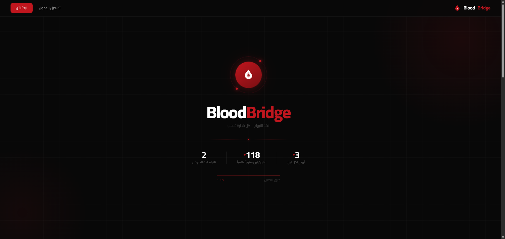
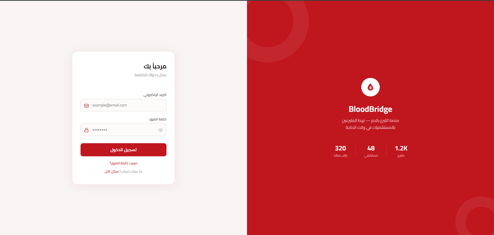
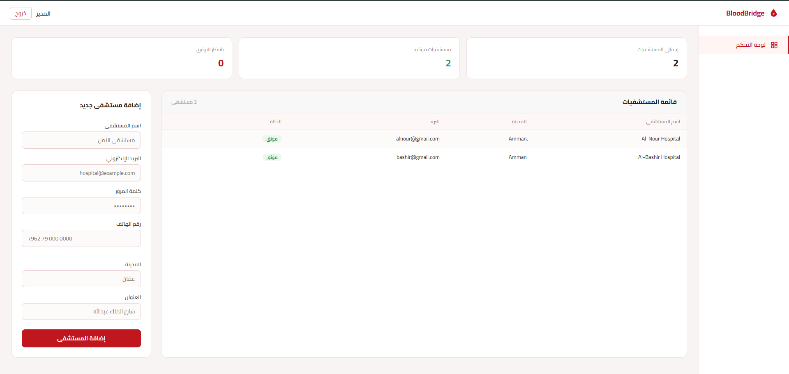
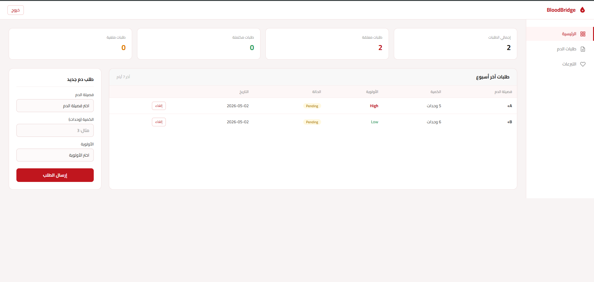
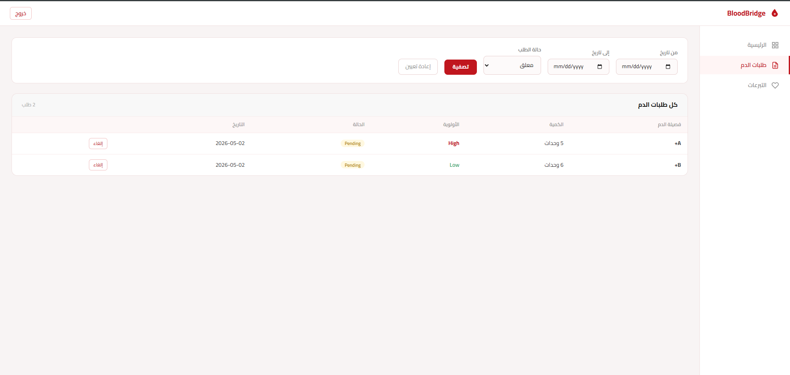
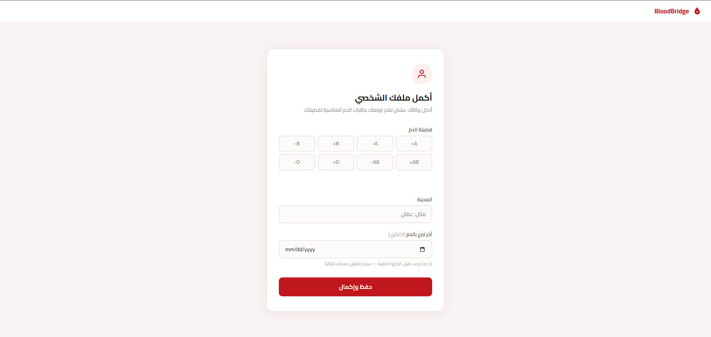
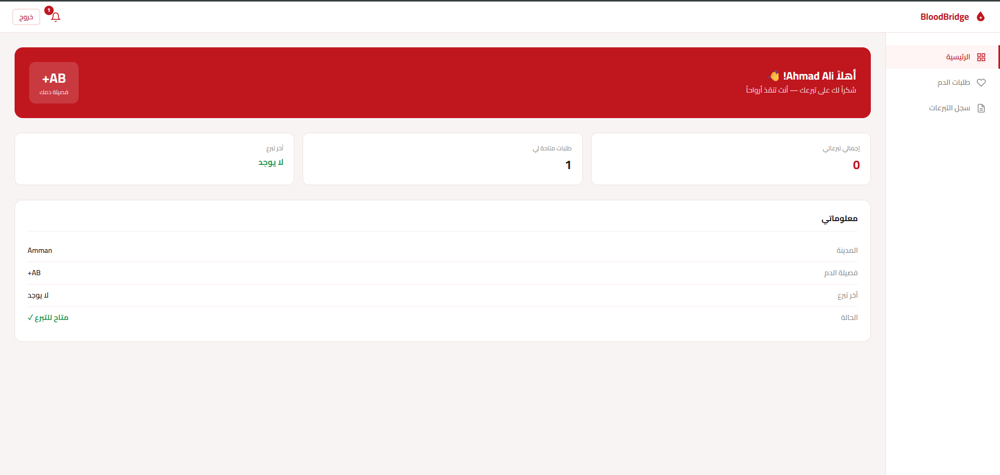

# 🩸 BloodBridge
## Blood Donation Platform

BloodBridge is a full-stack web application developed to connect blood donors with hospitals. The system streamlines the blood donation process by allowing hospitals to post blood requests, donors to respond, and admins to manage and verify hospitals.

---

---

## Features

- Donor registration and profile management
- Hospital blood request creation and management
- Donation tracking and confirmation workflow
- Admin panel for hospital management and verification
- Role-based access control
- Real-time notifications for matching donors

---

## 📸 Screenshots

### Login Page

### Admin Dashboard

### Hospital Dashboard

### Hospital Blood Requests

### Donor Complete Profile

### Donor Dashboard

---

## Technologies Used

### Backend
- ASP.NET Core (.NET 9)
- Entity Framework Core
- RESTful API
- JWT Authentication
- Role-Based Authorization
- BCrypt Password Hashing
- C#

### Frontend
- Angular 17
- Bootstrap 5
- TypeScript
- HTML & CSS

### Database
- PostgreSQL

## Tools
- Git & GitHub
- Azure DevOps
- Visual Studio
- VS Code
- Postman
- Swagger
- pgAdmin

---

## Author
Mohammad Abu-Alasal  
Computer Science Graduate – Jordan University of Science and Technology  
